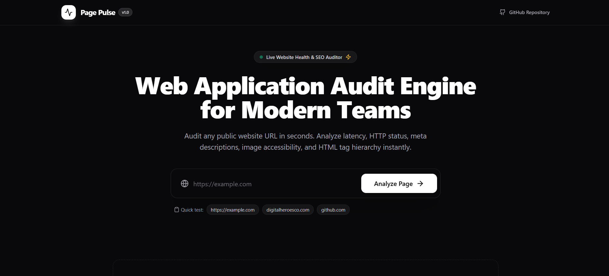
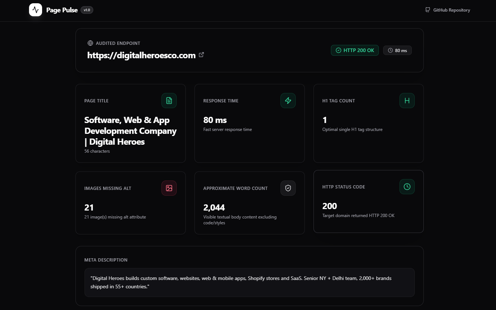
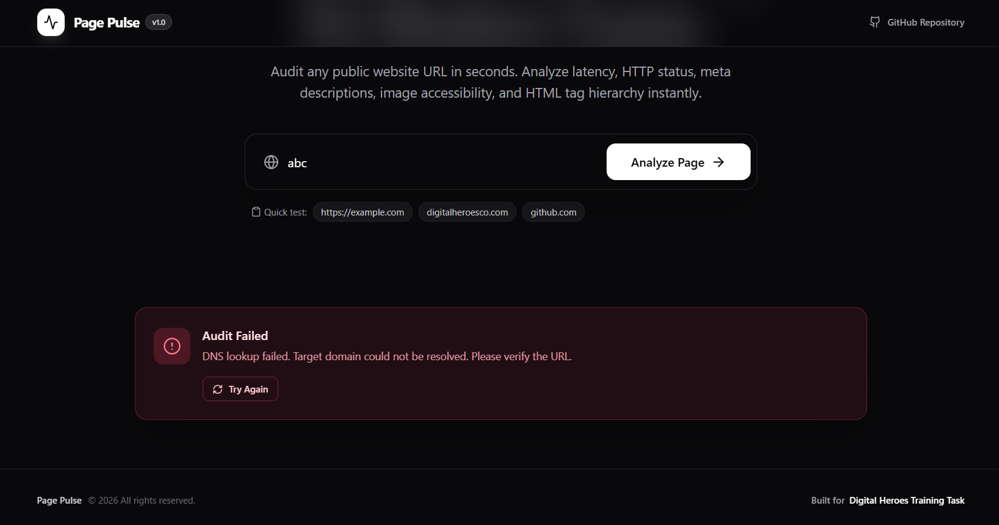
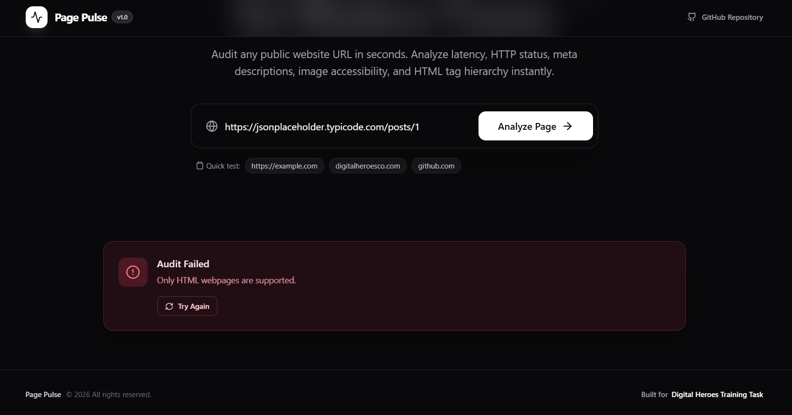

# Page Pulse ⚡

> Production-ready Web Application Audit & Health Engine for modern engineering teams. Built for Software Development (SDE) Assessment.

[](https://www.typescriptlang.org/)
[](https://react.dev/)
[](https://expressjs.com/)
[](https://tailwindcss.com/)
[](https://jestjs.io/)

**Page Pulse** is a fast, stateless web application auditing platform built to evaluate public websites for health, accessibility, and structural markup completeness. By entering any public URL, the engine fetches raw HTML, measures exact network latency, validates content types, and extracts critical metrics—including HTTP status, page title, meta description, H1 heading structure, images lacking ALT attributes, and visible body word count—delivering real-time results in an intuitive, Vercel/Linear-inspired dark mode dashboard.

---

## 🚀 Features

- ⚡ **Instant URL Auditing**: Measures HTTP status code & exact response latency in milliseconds.
- 🎯 **SEO Structural Analysis**: Extracts `<title>` tags, `<meta name="description">` tags, and counts `<h1>` heading elements.
- ♿ **Accessibility Inspection**: Identifies images missing descriptive `alt` attributes.
- 📝 **Content Metrics**: Calculates approximate body text word count, excluding `<script>`, `<style>`, `<nav>`, and `<svg>` tags.
- 🛑 **Strict Content-Type Validation**: Detects non-HTML responses (PDFs, JSON APIs, images) and returns a clean `422 Unprocessable Entity` response before parsing.
- 🛡️ **Bulletproof Error Resilience**: Gracefully handles invalid URLs, timeouts, 404/500 HTTP errors, DNS lookup failures (`ENOTFOUND`), and connection drops without crashing.
- 🎨 **Modern SaaS Interface**: Ultra-clean dark theme styled with Tailwind CSS, glassmorphism blur effects, Lucide icons, loading skeletons, and interactive metric badges.
- ⏱️ **Initial Load Splash Screen**: Smooth 9-square animated grid loading screen on initial page visit or refresh.

---

## 📸 Screenshots

### Landing Page



### Audit Results Dashboard



### Error State Alert



### Unsupported Content Type Error



## 🎥 Demo Video

## [▶ Watch Project Demo](assets/loom-video.mp4)

## 🛠️ Tech Stack

| Category               | Technology                           | Description                                                |
| :--------------------- | :----------------------------------- | :--------------------------------------------------------- |
| **Frontend Framework** | React 18 + Vite                      | High-performance single page application setup with HMR    |
| **Language**           | TypeScript                           | Strong typing across frontend models & backend contracts   |
| **Styling**            | Tailwind CSS + CSS Variables         | Modern dark mode theme with glassmorphism utilities        |
| **UI Components**      | Custom shadcn/ui primitives          | Standardized Button, Input, Card, and Badge primitives     |
| **Icons**              | Lucide React                         | Clean, modern iconography                                  |
| **Backend Runtime**    | Node.js + Express                    | Fast, unopinionated web framework for backend REST API     |
| **Parsing & Fetching** | Axios + Cheerio                      | Fast HTTP client & server-side jQuery-like HTML DOM parser |
| **Schema Validation**  | Zod                                  | Runtime validation for URL input schemas                   |
| **Testing**            | Jest + Supertest                     | Automated integration test suite for backend API endpoints |
| **Deployment**         | Vercel (Frontend) / Render (Backend) | Production hosting infrastructure                          |

---

## 🏗️ Project Architecture

```
User (Browser)
     │
     ▼
React Frontend (Vite + Tailwind CSS + Custom Hook: useAudit)
     │
     ▼  POST /api/audit
Express Backend (Validation Middleware -> AuditController -> AuditService)
     │
     ▼  Axios GET (User-Agent + Timeout + Content-Type Check)
Target Web Application
     │
     ▼  Raw HTML Response
Cheerio Parser Engine (DOM Metrics & Word Counter)
     │
     ▼  Structured JSON Payload
React Dashboard UI (Metric Cards + Status Badges)
```

### Layer Responsibilities

1. **Frontend Presentation**: Renders the dark-mode landing page, manages audit state transitions (`idle`, `loading`, `success`, `error`), and displays animated metric cards.
2. **API Layer**: Centralized `ApiService` that sends HTTP POST requests to `/api/audit`.
3. **Controller Layer**: Thin `AuditController` that validates incoming request payloads using Zod schemas.
4. **Service Engine**: `AuditService` executes HTTP requests via Axios, checks headers for `text/html`, parses DOM with Cheerio, and calculates text metrics.
5. **Centralized Error Middleware**: Intercepts `AppError` instances and converts them into standardized JSON error structures.

---

## 📂 Folder Structure

```
page-pulse/
├── backend/
│   ├── src/
│   │   ├── config/          # Centralized environment constants & timeout settings
│   │   ├── controllers/     # Express route handlers (AuditController)
│   │   ├── middlewares/     # Global error handler & Zod validation interceptor
│   │   ├── routes/          # Express route definitions (/api/audit, /api/health)
│   │   ├── services/        # Business logic & Cheerio HTML parser engine
│   │   ├── types/           # Backend TypeScript interface declarations
│   │   ├── utils/           # Custom error class (AppError) & DOM word counter
│   │   ├── validators/      # Zod schema definitions for request payloads
│   │   ├── app.ts           # Express application configuration
│   │   └── server.ts        # Server entrypoint listener
│   ├── tests/               # Jest & Supertest API integration tests
│   ├── jest.config.js       # ts-jest configuration file
│   ├── package.json
│   └── tsconfig.json
├── frontend/
│   ├── src/
│   │   ├── components/
│   │   │   ├── audit/       # Metric cards, AuditForm, AuditResults grid, Skeletons
│   │   │   ├── common/      # StatusBadge, ErrorAlert, EmptyState, InitialLoader
│   │   │   ├── layout/      # Header, Hero, Footer, Container
│   │   │   └── ui/          # Standardized primitives (Button, Input, Card, Badge)
│   │   ├── hooks/           # Custom React hook (useAudit)
│   │   ├── lib/             # Utility helpers (clsx, tailwind-merge)
│   │   ├── pages/           # DashboardPage controller
│   │   ├── services/        # ApiService HTTP client wrapper
│   │   ├── styles/          # Tailwind setup, CSS keyframe animations, glassmorphism
│   │   ├── types/           # Frontend TypeScript interfaces
│   │   ├── App.tsx          # Main application entry with splash screen timer
│   │   └── main.tsx         # React DOM root entry point
│   ├── index.html
│   ├── package.json
│   ├── vite.config.ts
│   └── tailwind.config.js
├── README.md
└── .gitignore
```

---

## 🚦 Installation & Local Setup

### Prerequisites

- **Node.js**: v18.x or above
- **npm**: v9.x or above

### Step-by-Step Instructions

1. **Clone the repository**:

   ```bash
   git clone https://github.com/AryaVispute/page-pulse.git
   cd page-pulse
   ```

2. **Install Backend Dependencies**:

   ```bash
   cd backend
   npm install
   ```

3. **Install Frontend Dependencies**:

   ```bash
   cd frontend
   npm install
   ```

4. **Run the Backend Server**:

   ```bash
   cd backend
   npm run dev
   # Server starts on http://localhost:5000
   ```

5. **Run the Frontend App**:
   ```bash
   cd frontend
   npm run dev
   # App runs on http://localhost:5173
   ```

---

## ⚙️ Environment Variables

### Backend (`backend/.env`)

```env
PORT=5000
NODE_ENV=development
CORS_ORIGIN=*
REQUEST_TIMEOUT=10000
```

| Variable          | Default       | Description                                            |
| :---------------- | :------------ | :----------------------------------------------------- |
| `PORT`            | `5000`        | Port number for Express API server                     |
| `NODE_ENV`        | `development` | Node environment state                                 |
| `CORS_ORIGIN`     | `*`           | Configured CORS origin whitelist                       |
| `REQUEST_TIMEOUT` | `10000`       | Axios HTTP request timeout limit in milliseconds (10s) |

### Frontend (`frontend/.env`)

```env
VITE_API_URL=https://page-pulse-api-7sjr.onrender.com
```

> For local development, set `VITE_API_URL` to your backend URL (e.g. `http://localhost:5000` when running locally or your deployed Render URL in production).

---

## 🔌 API Documentation

### `POST /api/audit`

Audits a public web application URL and returns health & SEO metrics.

#### Request Body

```json
{
  "url": "https://example.com"
}
```

---

### API Responses

#### 1. Success Response (`200 OK`)

```json
{
  "status": 200,
  "responseTime": 142,
  "title": "Example Domain",
  "metaDescription": "This domain is for use in illustrative examples in documents.",
  "h1Count": 1,
  "imagesWithoutAlt": 0,
  "wordCount": 38
}
```

#### 2. Validation Error (`400 Bad Request`)

```json
{
  "success": false,
  "status": 400,
  "message": "Invalid URL format. Please provide a valid http or https URL.",
  "error": "Invalid URL format. Please provide a valid http or https URL.",
  "code": "INVALID_URL"
}
```

#### 3. Unsupported Content Type (`422 Unprocessable Entity`)

```json
{
  "success": false,
  "status": 422,
  "message": "Only HTML webpages are supported.",
  "error": "Only HTML webpages are supported.",
  "code": "NON_HTML_RESPONSE"
}
```

#### 4. DNS Lookup Failure (`400 Bad Request`)

```json
{
  "success": false,
  "status": 400,
  "message": "DNS lookup failed. Target domain could not be resolved. Please verify the URL.",
  "error": "DNS lookup failed. Target domain could not be resolved. Please verify the URL.",
  "code": "DNS_LOOKUP_FAILED"
}
```

#### 5. Timeout Error (`504 Gateway Timeout`)

```json
{
  "success": false,
  "status": 504,
  "message": "Connection timeout. Target site failed to respond within 10 seconds.",
  "error": "Connection timeout. Target site failed to respond within 10 seconds.",
  "code": "GATEWAY_TIMEOUT"
}
```

---

## 🛡️ Error Handling Strategy

The application guarantees that the server **never crashes** when encountering unexpected network or content failures:

- **Schema Validation**: Inputs are sanitized and validated with Zod before making external network calls.
- **Header Inspection**: Axios checks response headers (`response.headers.get('content-type')`) to verify `text/html` before passing data to Cheerio.
- **Network Error Mapping**: Specific network code mappings capture `ENOTFOUND` (DNS failure), `ECONNREFUSED` (Connection refused), `ECONNABORTED` (Timeout), and SSL certificate issues.
- **Centralized Express Error Handler**: Catches all thrown `AppError` instances and standardizes the JSON response payload.

---

## 🧪 Testing

Backend integration tests are implemented using **Jest** and **Supertest**.

### Running Tests

```bash
cd backend
npm test
```

### Test Coverage Breakdown

| Test Suite         | Case                                                                     | Expected Result                                                       |
| :----------------- | :----------------------------------------------------------------------- | :-------------------------------------------------------------------- |
| **Happy Path**     | Valid HTML Website (`https://example.com`)                               | Returns HTTP `200` with all 7 metric fields                           |
| **Failure Case 1** | Malformed URL string (`http://`)                                         | Returns HTTP `400` with error code `INVALID_URL`                      |
| **Failure Case 1** | Missing payload (`{}`)                                                   | Returns HTTP `400` with error code `INVALID_URL`                      |
| **Failure Case 2** | Non-HTML JSON endpoint (`https://jsonplaceholder.typicode.com/todos/1`)  | Returns HTTP `422` with message `"Only HTML webpages are supported."` |
| **Failure Case 3** | Unreachable domain (`https://thisdomainshouldneverexist12345abcxyz.com`) | Returns HTTP `400` with code `DNS_LOOKUP_FAILED`                      |

---

## 💡 Architecture & Design Decisions

### 1. Using Axios + Cheerio Instead of Puppeteer

- **Rationale**: Headless browsers like Puppeteer require heavy memory overhead (~100MB+ per instance) and slow execution speeds (2-5s spin-up time per page). Cheerio combined with Axios provides lightning-fast HTML parsing in milliseconds while keeping memory usage under 10MB, making the service lightweight, cost-effective, and highly scalable.

### 2. Layered Backend Architecture (Routes -> Controllers -> Services -> Utilities)

- **Rationale**: Separating routing rules, request validation, business logic, and error handlers ensures clean code organization. Controllers remain thin, while services handle DOM evaluation and network calls independently, simplifying unit testing and code maintainability.

### 3. Reusable UI Primitives & Custom React Hooks (`useAudit`)

- **Rationale**: Isolating API state management (`idle`, `loading`, `success`, `error`) inside a custom `useAudit` hook keeps React components clean and focused purely on presentation. Reusable shadcn-styled components ensure visual consistency across the entire SaaS dashboard.

---

## 🔮 Future Improvements

- 📊 **Lighthouse Performance Score**: Integrate Google PageSpeed Insights API for real user metrics (LCP, CLS, FID).
- 🔗 **Broken Link Detection**: Recursively scan extracted page links to verify HTTP status codes.
- 🖨️ **PDF Report Export**: Allow users to download audit reports formatted as structured PDF documents.
- ⚡ **Redis Caching Layer**: Cache URL audit reports with a 5-minute TTL to reduce redundant external requests.
- ♿ **Automated WCAG Accessibility Scoring**: Expand image ALT audits to include ARIA attributes, color contrast, and form label checks.

---

## 🌐 Deployment

- **Frontend**: Hosted on **Vercel** (`https://page-pulse-sable-psi.vercel.app`).
- **Backend**: Hosted on **Render** (`https://page-pulse-api-7sjr.onrender.com`).

> **Note on Render Deployment**: Render free-tier web services automatically spin down after 15 minutes of inactivity. Initial requests after idle periods may experience a short cold start delay (~30s).

---

## 🛠️ Challenges Faced & Solutions

1. **Safe Content-Type Header Extraction**:
   - _Challenge_: Axios 1.x uses `AxiosHeaders` objects, where standard bracket notation `headers['content-type']` sometimes returned `undefined`.
   - _Solution_: Implemented a safe fallback check using `response.headers.get('content-type')` to guarantee reliable header parsing across all Node versions.

2. **Accurate Visible Word Counting**:
   - _Challenge_: Extracting body text using `.text()` included inline JavaScript scripts, CSS stylesheets, and SVG icon text strings.
   - _Solution_: Created a custom `calculateWordCount` utility that clones the Cheerio DOM instance and strips `script`, `style`, `noscript`, `svg`, `code`, and `nav` elements before splitting text content.

3. **Handling websites protected by Cloudflare or anti-bot mechanisms**:
   - _Challenge_: Some websites return challenge pages or restricted responses instead of the expected HTML.
   - _Solution_: The application detects these responses gracefully and reports meaningful results without crashing.

---

## 📝 Mandatory Credits

Built for **Digital Heroes Training Task** — [https://digitalheroesco.com](https://digitalheroesco.com).
